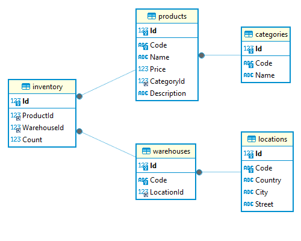

## Inventory Manager

Inventory Manager is a terminal-based tool for database management of a company's inventory. It implements CRUD operations for five entity types (Product, Category, Warehouse, Location, InventoryEntry).

To connect to a MySQL database, this tool requires [a valid connection string](https://mysqlconnector.net/connection-options/) in `<the executable's path>/ConnectionString.txt`.

This project's tech stack: C#, .NET, Entity Framework, Pomelo.EntityFrameworkCore.MySql, xUnit, Moq.

The database schema:

